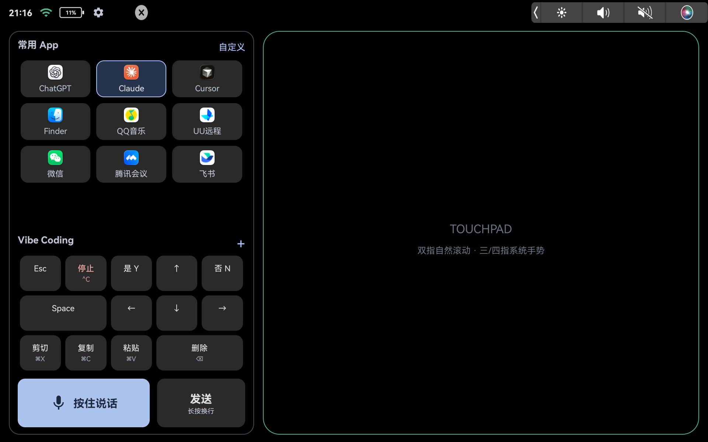
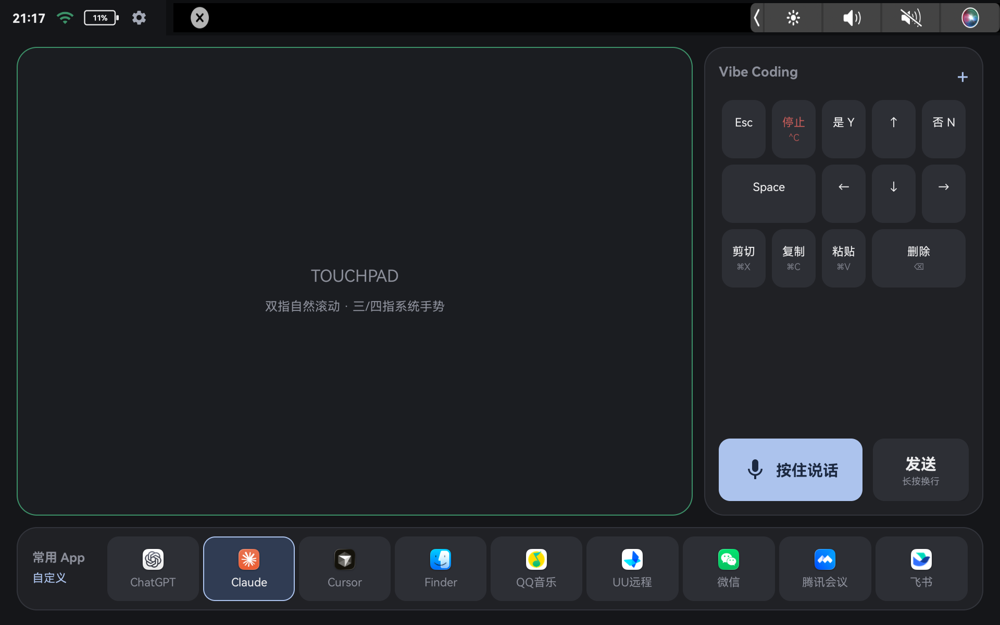
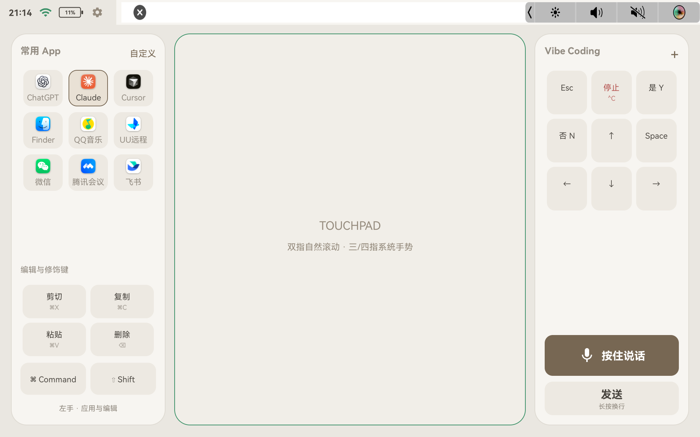
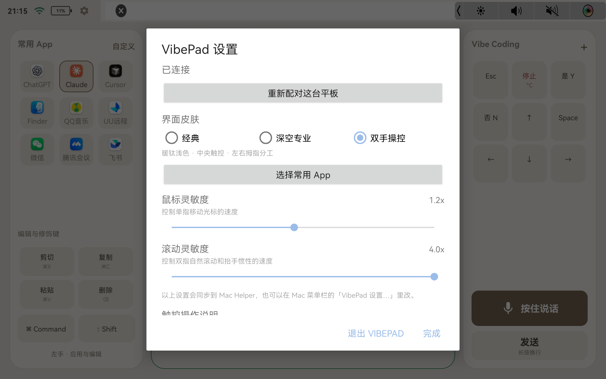

# VibePad

<p align="center"></p>

安卓平板变 Mac 无线触控台：触控板与系统手势、Vibe Coding 快捷键、Touch Bar 画面回传、
平板麦克风直通 Typeless。平板与 Mac 在同一局域网内自动发现、直连，
第一次使用核对一次 6 位验证码即可，之后自动重连。

## 界面预览（真机截图）

三套皮肤，在平板设置弹层或 Mac 菜单栏「VibePad 设置…」里随时切换：

| 经典（classic） | 深空专业（graphite） | 双手操控（titanium） |
| :---: | :---: | :---: |
| [](docs/assets/vibepad-classic.png) | [](docs/assets/vibepad-graphite.png) | [](docs/assets/vibepad-titanium.png) |

- **经典**：左手一列集成常用 App、Vibe Coding 键位与编辑键，右侧整面触控板。
- **深空专业**：左侧大触控板 + 右侧快捷键列 + 底部 App 坞。
- **双手操控**：中央触控板，左右两列按拇指分工（左边应用与编辑、右边 Vibe Coding）。

## 快速上手（照着做就行）

### 第 0 步：确认条件

- 一台 Mac（macOS 12 或更新）和一台安卓平板（Android 9 或更新，横屏使用）。
- 两台设备连**同一个 WiFi**（5GHz 频段体验最好）。

### 第 1 步：安装（在 Mac 上操作）

**方式 A：下载安装包（推荐，不用构建）**

到 [Releases](https://github.com/xiaoxi668v-prog/vibepad/releases/latest) 下载两个文件：

1. `VibePadHelper-x.x.x-macos.zip`：解压后把 `VibePad Helper.app` 拖进「应用程序」。
   **首次打开要右键 → 打开**（个人开发者签名未公证，Gatekeeper 会拦一次，属正常）。
2. `VibePad-x.x.x.apk`：装到平板上，任选一种：
   - 平板 USB 连 Mac（开 USB 调试），执行 `adb install VibePad-x.x.x.apk`；
   - 或把 APK 通过微信/网盘发到平板上直接点击安装（允许「未知来源」）。

**方式 B：从源码构建**

```bash
git clone https://github.com/xiaoxi668v-prog/vibepad.git
cd vibepad
export SIGNING_IDENTITY="Apple Development: 你的邮箱 (你的团队ID)"
scripts/release-vibepad.sh --install
```

脚本会自动做完三件事：把 Mac 端 Helper 装进 `~/Applications` 并注册开机自启、
给插着的平板装好 App。中途如果提示缺少工具（Xcode 命令行工具、JDK 17、
Android SDK），按提示装好再跑一次即可。

> `SIGNING_IDENTITY` 用免费 Apple ID 在 Xcode 里登录后即可获得
> （Xcode → 设置 → Accounts → 添加 Apple ID → Manage Certificates 点 +）。
> 必须固定用同一个身份，不要省略这一步——否则每次更新 Mac 都会静默收回授权。
> 方式 A 下载的包由项目作者签名，不受影响。

### 第 2 步：给 Mac 授权（只做一次）

第一次启动 Helper 时，Mac 会提示缺少「辅助功能」权限：
系统设置 → 隐私与安全性 → 辅助功能 → 打开 **VibePad Helper**，然后重启 Helper。
如果 macOS 问「是否允许传入网络连接」，选**允许**。

### 第 3 步：配对（只做一次）

1. 平板打开 VibePad，点左上角 **齿轮** 打开设置；
2. 点「**重新配对这台平板**」；
3. Mac 菜单栏点 VibePad 图标 → 「**允许配对新平板（60 秒）**」；
4. 平板和 Mac 会显示**同一个 6 位验证码**，核对一致后在 **Mac 上**点「允许」。

<p align="center"></p>

配对成功后平板顶栏显示「已连接」，以后打开 App 会自动重连，不用再配对。

### 第 4 步：开始用

- **触控板**：单指移动光标、轻点=左键、双指滚动、双指轻点=右键、
  捏合缩放、三/四指滑动触发 Mission Control 等系统手势。
- **按住说话**：按住右下角的麦克风按钮说话，松开后语音直通 Mac 上的
  Typeless 转写（此功能需要先在 Mac 安装 TFFAudio 虚拟声卡，不装也不影响其他功能）。
- **换皮肤 / 改灵敏度 / 设置常用 App**：平板点齿轮，或在 Mac 菜单栏
  「VibePad 设置…」里改，两端自动同步。

### 常见问题

| 症状 | 解决办法 |
| --- | --- |
| 平板一直「正在查找 Mac」 | 确认两台设备在同一个 WiFi；在 Mac 菜单栏重启 Helper |
| 平板显示已连接但 Mac 没反应 | 辅助功能授权丢了：系统设置里重新打开 VibePad Helper 的开关 |
| 「按住说话」没反应 | Mac 没装 TFFAudio 虚拟声卡，装上即可；不用此功能可忽略 |
| 想卸载 | 删除 `~/Applications/VibePad Helper.app`，并删除 `~/Library/LaunchAgents/com.xiaoxi.vibepad.mac-helper.plist`；平板上正常卸载 App |

## 给开发者

### 结构

```text
android/     安卓平板 App（Kotlin，包名 com.xiaoxi.vibepad）
mac-helper/  Mac 菜单栏 Helper（Swift，Bundle ID com.xiaoxi.vibepad.helper）
designs/     平板端三套 UI 皮肤（01 经典黑 / 02 深空专业 / 05 双手操控）与设计源码
scripts/     发布脚本与 LaunchAgent 模板
docs/assets/ README 用到的图标与真机截图
dist/        发布产物（本地产出，不进 git）
backups/     安装前自动备份（本地产出，不进 git）
```

### 环境要求

- macOS 12+，Xcode 命令行工具（`swift build`）。
- 一个稳定的 Apple Development 签名身份（免费 Apple ID 即可）。Helper 需要
  “辅助功能”权限，而 ad-hoc 签名每次构建都会变成“新应用”并静默丢失授权，
  所以脚本强制要求固定身份，见 [mac-helper/README.md](mac-helper/README.md)。
- Android 9（API 28）以上的横屏平板，JDK 17 与 Android SDK。
- 麦克风直通功能额外依赖 TFFAudio 虚拟回环声卡（设备 UID
  `com.toofifi.audio.Loopback_v001`）。未安装时触控、键盘、Touch Bar 照常可用，
  仅“按住说话”不可用，Helper 启动日志会提示未找到该设备。

### 构建与发布

```bash
export SIGNING_IDENTITY="Apple Development: you@example.com (TEAMID1234)"
scripts/release-vibepad.sh            # 构建 + 签名 + 打包到 dist/
scripts/release-vibepad.sh --install  # 并安装到本机 ~/Applications 与已连接平板
```

脚本在签名身份缺失时直接停止，绝不回退 ad-hoc 签名。`JAVA_HOME`、`ANDROID_HOME`、
`VIBEPAD_INSTALL_DIR` 均可用环境变量覆盖。

配置同步：界面皮肤、常用 App 和触控灵敏度可以在 Mac 菜单栏的「VibePad 设置…」
里配置，两端通过 `0x60/0x61/0x62` 三个帧双向同步，Mac 侧存在
`~/Library/Application Support/VibePad/pad-config.json`。

### 安全边界

- 配对使用临时 P-256 ECDH + HKDF 派生每台平板独立密钥，两端显示同一 6 位验证码，
  只能在 Mac 上允许；密钥分别存于 macOS Keychain 与 Android Keystore。
- 每次重连做双向 HMAC 挑战应答，旧请求不能重放；未认证连接不能注入任何输入。
- 认证之后的会话**没有逐帧加密和完整性校验**，只适合可信局域网。请不要在公共
  Wi-Fi 上使用；如需对外发布，应为整个会话加 TLS 或逐包 AEAD。

## 许可证

[MIT](LICENSE)。`designs/orbit-source/assets/icons/` 下的图标来自 Lucide，
许可见同目录 `LICENSE-lucide.txt`。
